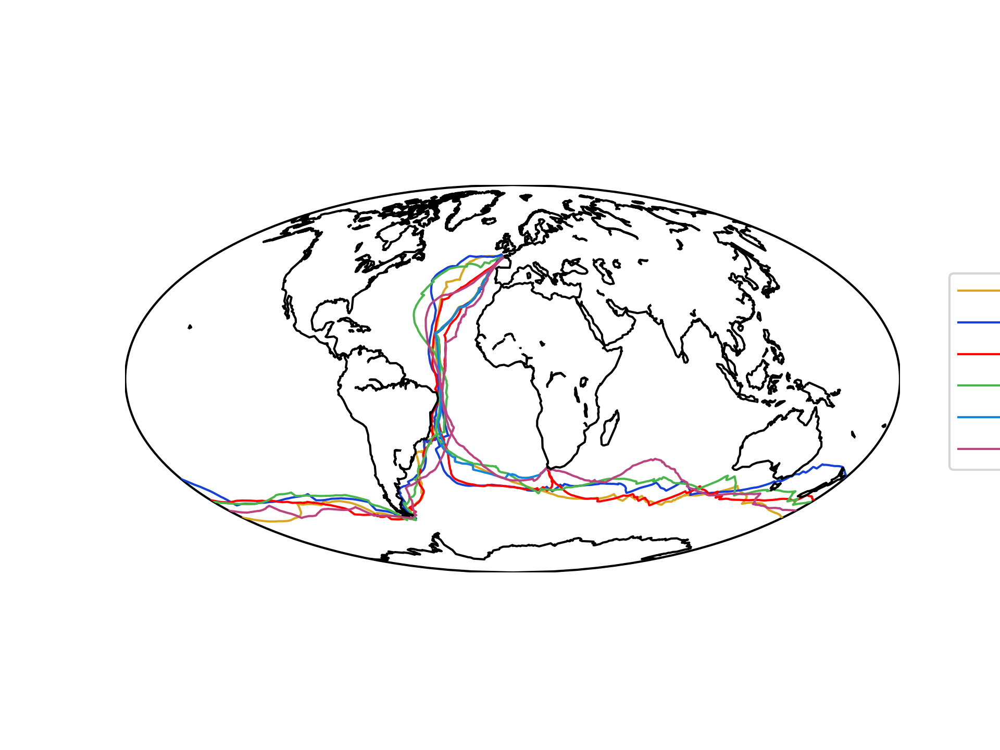

# sailing-data-analysis

Contains various script and dataset to analyze and visualize sailing data.

## Datasets

### AC-36 data from Virtual-Eye

Dataset that contains the position, speed, heading, and other data from the 36th America's Cup. The data is in JSON format and is available in the `ac36data` folder. The followigin firgure summarises the data available.

#### We can the visualize the races

#### Do some simple analysis

#### Look at the correlation between various data field

### Transat Jacques Vabre 2023

### Arkea Ultim Challenge Brest 2024

## Scripts

#### Read GPS data and plot tracks. 

The script `Track-Reader/plot_track.py` reads the GPS data and plots the tracks. The following figure shows the track of the Bol d'Or Mirabaud 2022 and the Geneve-Rolle-Geneve 2022 regattas.

[BOM and GRG 2022](Track-Reader/M2-Both.html)